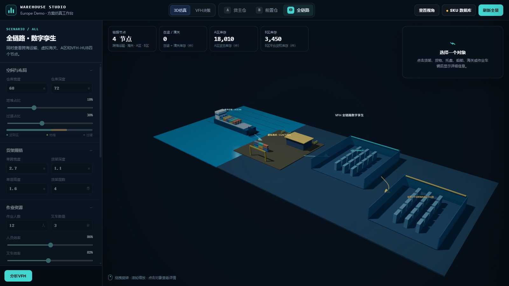

# Warehouse Digital Twin · 海外仓仿真与前置仓决策演示

一个面向海外仓规划的交互式数字孪生作品：把跨海在途、虚拟海关、货主自营仓、平台前置仓、SKU 打托、库位布局与经营成本放在同一个模型中比较。

> 本仓库是用于作品集和技术交流的公开演示版。所有 SKU、库存、批次、费率、国家和仓库参数均为合成数据，不代表任何企业的真实经营信息。



## 解决的问题

- 新市场是否值得建立平台前置仓，以及建议面积、人员和叉车配置
- 已建前置仓是否需要扩容、缩容、调整货架与地堆比例
- 当前入库、出库与转运节奏下是否存在爆仓或人力不足风险
- 加班与增员哪一种成本更优
- 不同 SKU 应进入货架还是地堆，以及打托规格是否可行
- 数据完整度不足时，如何使用预警模式和稀疏数据模式保留决策能力

## 主要能力

- Three.js 交互式 3D 仓库、全链路视角和对象点击详情
- A/B 两个仓区的面积、货架、过道、地堆、人效和叉车参数调节
- SKU 真实比例打托模拟，计算单层排布、堆高、容量和托盘利用率
- 货架与地堆安全间距约束，避免 3D 模型穿模
- 批次级库龄与免租期计费
- 海运在途与虚拟海关库存管道
- 8 小时离散事件作业仿真与时间轴回放
- 建仓/不建仓成本比较、面积与人员搜索、利用率和回收期分析
- CSV 批次数据导入和 SQLite 本地持久化

## 技术栈

- Python / FastAPI / Pydantic
- SQLite
- JavaScript / Three.js / HTML / CSS
- 离散事件仿真、情景分析与启发式配置搜索

## 快速运行

Windows 可双击 `start.bat`，或执行：

```powershell
python -m pip install -r requirements.txt
python -m uvicorn server:app --host 127.0.0.1 --port 8000
```

浏览器打开：

- 默认仓库视角：<http://127.0.0.1:8000/>
- 全链路视角：<http://127.0.0.1:8000/?view=network>

## 演示数据

仓库内置 20 个完全虚构的 `DEMO-*` SKU、35 条库存记录和 6 个批次。重新生成演示数据库：

```powershell
python db_init.py --force
```

批次导入格式见 `vfh_batch_import_template.csv`。区域代码为：

- `A`：货主自营仓
- `B`：平台前置仓
- `SEA`：海运在途
- `CUSTOMS`：虚拟海关

## 模型边界

本项目用于展示建模、仿真、可视化和决策支持能力，不应直接用于投资或产能承诺。正式使用前需要用合同费率、真实批次收发存、工时、预约/拒收与订单结构完成校准和业务复核。

## 简历摘要

独立构建海外仓数字孪生与经营决策平台，使用 FastAPI、SQLite 和 Three.js 建模海运在途、虚拟海关、A/B 仓转运、批次库龄计费、人员与面积配置，并实现 SKU 级 3D 打托和多情景成本分析。
